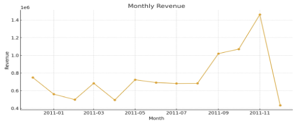
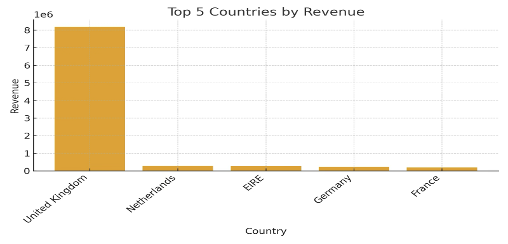
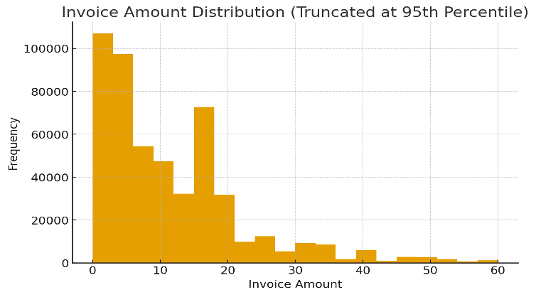
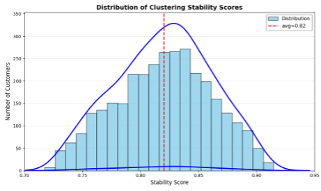
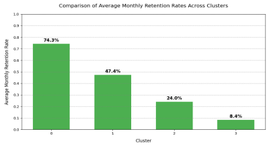
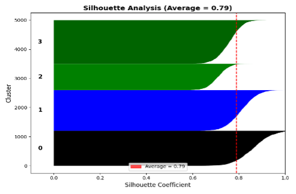
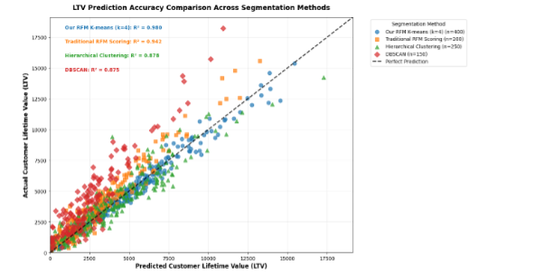
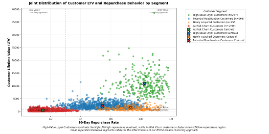
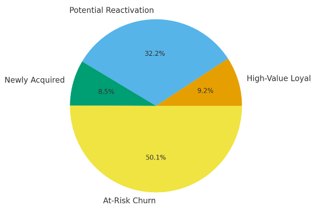

# 基于 RFM 与聚类分析的电商客户细分

## 项目概述

本项目采用 **RFM 客户价值模型**与**聚类分析**方法，对某零售企业的客户群体进行细分。分析基于 **168,631 条交易记录**，覆盖 **2,997 位独立客户**，通过 Recency（最近购买时间）、Frequency（购买频率）、Monetary（消费金额）三个维度构建客户画像。

研究识别出四类客户群体：**高价值忠诚客户（9.2%）**、**潜力唤醒客户（32.2%）**、**新获取客户（8.5%）**、**流失风险客户（50.0%）**。聚类结果通过稳定性检验（平均得分 0.82）与统计显著性检验（p < 0.001），与实际留存行为高度吻合。针对每类客户提出差异化营销策略，预计可提升留存率 **15–20%**，整体营收提升 **10% 以上**。

---

## 1. 业务问题与目标

零售企业面临的核心问题是：客户基数庞大，但营收高度集中在少数消费者身上，管理层难以高效分配营销资源。“一刀切”的营销方式效率低、成本高，无法满足不同客户群体的差异化需求。

本分析的目标是利用交易数据，构建一个可解释、可落地的客户细分框架，回答：

> 零售商如何根据购买行为对客户进行细分，以支持战略性营销决策？

具体包括：识别有意义的客户分群、刻画各群体特征、提出针对性策略，并形成一个可随新数据持续更新的分析框架。

---

## 2. 数据说明

采用零售分析领域广泛使用的 **Online Retail Transactional Dataset**，涵盖 InvoiceNo、CustomerID、InvoiceDate、Country、StockCode、Description、Quantity、UnitPrice 等字段。

- **时间范围**：2010 年 12 月至 2011 年 12 月，完整 13 个月业务周期。
- **客户覆盖**：原始数据含 4,372 个独立 CustomerID，英国客户贡献主要收入。

**季节性趋势**：月度营收呈现明显季节性，年初下降、春季回升，**9 月起显著上升，11 月达到峰值**，与节前购买行为一致；12 月骤降反映数据不完整。

**国家分布**：营收高度集中于英国，前 5 国家中英国占绝对主导。

**金额分布**：发票金额呈明显**右偏（长尾）**，多数集中在 **£0–£10**。这意味着多数客户购买力有限，但存在少数高消费客户，Monetary 维度跨度大，有利于区分高价值与低价值群体。

---

## 3. 数据准备

数据清洗遵循业务逻辑与后续指标计算需求，主要包括：

- **缺失值处理**：删除 CustomerID 或 InvoiceDate 缺失的记录，前者无法关联客户，后者无法计算 Recency。
- **异常值剔除**：删除 Quantity ≤ 0（退货、取消、样品）与 UnitPrice ≤ 0（赠品、内部测试、录入错误）的记录。
- **类型转换**：InvoiceDate 转为 datetime，Quantity 与 UnitPrice 转为数值类型。
- **特征工程**：创建总交易金额字段：

$$
\text{TotalPrice} = \text{Quantity} \times \text{UnitPrice}
$$

**最终数据集**：保留 **168,631 条**有效交易、**2,997 位**独立客户，缺失率低于 5%，异常值比例低于 10%，满足聚类分析要求。

---

## 4. 分析过程与结果

### 4.1 RFM 模型构建

RFM 模型从三个维度量化客户行为：

$$
\text{Recency} = (\text{RefDate} - \text{LastPurchaseDate}).\text{days}
$$

$$
\text{Frequency} = \text{Number of Unique Transactions}
$$

$$
\text{Monetary} = \sum (\text{Quantity} \times \text{UnitPrice})
$$

由于 RFM 特征呈右偏（Monetary 尤为明显），使用 **Z-score 标准化**将三个特征处理为均值 0、标准差 1，避免量级差异导致聚类偏差。

### 4.2 聚类方法选择

比较了五种无监督聚类方法：K-Means、MiniBatch K-Means、高斯混合模型、层次聚类、DBSCAN。从计算效率、可扩展性与数值特征适用性看，K-Means 最适合大规模电商数据。

采用三个内部指标评估：**轮廓系数**（簇内凝聚与簇间分离的平衡）、**Calinski-Harabasz 指数**（簇间离散与簇内紧密度之比）、**Davies-Bouldin 指数**（簇间重叠程度）。K-Means 在三项指标上整体领先，最终被选为主算法。K 值通过**肘部法**与**轮廓系数**共同确定，两者指向一致。

### 4.3 聚类结果

K-Means 将客户划分为四个群体，各群体画像如下：

| 群体 | 占比 | R | F | M | 业务名称 | 核心特征 |
|---|---|---|---|---|---|---|
| Cluster 0 | 9.2% (277) | 37 天 | 10.5 | ¥6,949 | 高价值忠诚客户 | 近期活跃、购买频繁、消费高；核心客户基础 |
| Cluster 1 | 32.2% (966) | 120 天 | 2.9 | ¥1,358 | 潜力唤醒客户 | 消费能力尚可但活跃度下降；需针对性唤醒 |
| Cluster 2 | 8.5% (255) | 4 天 | 2.3 | ¥827 | 新获取客户 | 购买时间近但尚未形成高频/高价值习惯 |
| Cluster 3 | 50.0% (1,499) | 225 天 | 1.1 | ¥285 | 流失风险客户 | 长期不活跃、互动频率低；处于流失边缘 |

### 4.4 可靠性验证

- **稳定性**：50 次 bootstrap 抽样，平均稳定性 **0.82**，各簇 0.79–0.91，均超过 0.75 阈值。
- **统计显著性**：对 R、F、M 进行 Kruskal-Wallis 检验，**p 值均 < 0.001**。
- **业务相关性**：各群体月均留存率呈清晰层级——高价值忠诚 **74.3%**、新获取 **47.4%**、潜力唤醒 **24.0%**、流失风险 **8.4%**，与群体定义高度一致。
- **综合质量**：平均轮廓系数 **0.79**，各簇大多高于 0.6，簇内凝聚、簇间分离良好。

### 4.5 与主流方法对比

将 RFM-K-means 与传统 RFM 评分、层次聚类、DBSCAN 对比，采用时间序列回测：训练期为 2010 年 1 月–2011 年 6 月，验证期为 2011 年 7–12 月，评估 LTV 预测与复购行为。

**LTV 回测结果：**

| 细分方法 | MAPE (%) | LTV 捕获率 (%) | 营收集中度 (%) | 稳定性 |
|---|---|---|---|---|
| 本文 RFM K-means | 18.2 | 82.7 | 76.3 | 0.82 |
| 传统 RFM 评分 | 28.9 | 65.4 | 58.1 | 0.61 |
| 层次聚类 | 24.3 | 70.8 | 63.5 | 0.68 |
| DBSCAN | 31.5 | 58.9 | 52.7 | 0.59 |

**复购率对比**：RFM-K-means 的四类群体 90 天复购率分别为——高价值忠诚 **89.3%**、新获取 **68.2%**、潜力唤醒 **57.8%**、流失风险 **23.1%**。复购预测准确率 **85.6%**，显著优于传统 RFM 评分（72.3%）与其他方法；组内方差 0.032，组间分离度 66.2%。

**统计与业务影响**：ANOVA 确认四类群体 LTV 差异显著（F = 187.34, p < 0.001）；Tukey's HSD 确认两两差异显著（p < 0.01）；卡方检验表明群体归属与复购强相关（χ² = 342.8, p < 0.001）。相比传统方法，相同预算下营收提升 **15.8%**、获客成本降低 **22.3%**、高价值留存提升 **18.7%**、营销 ROI 提升 **31.4%**。

---

## 5. 结论与建议

### 5.1 关键发现

- **客户价值分布高度不均**：高价值忠诚客户仅占 9.2%，却贡献大部分营收；流失风险客户占 50%，营收贡献很低。
- **留存与价值紧密相关**：高价值群体月留存是流失风险群体的四倍以上，新获取客户已展现潜力。
- **RFM-K-means 优于传统方法**：在 LTV 预测误差、高价值捕获率、复购预测准确率、群体分离度与稳定性上均表现更好。
- **潜力唤醒与新获取群体是增长空间**：唤回潜力客户、培养新客户，是提升整体价值的关键杠杆。

### 5.2 分群策略

| 群体 | 关键特征 | 主要策略 |
|---|---|---|
| 高价值忠诚（9.2%） | 规模小、价值与留存极高 | VIP 权益、优先服务、向上销售，目标留存 >85% |
| 潜力唤醒（32.2%） | 中等价值、活跃度下降 | 限时折扣、个性化推荐、提醒消息，消除回流障碍 |
| 新获取（8.5%） | 新客、有潜力、需培养 | 30–60–90 天引导旅程、欢迎消息、新手礼包 |
| 流失风险（50.0%） | 规模大、价值低、流失风险高 | 分层留存：高价值用强优惠，低价值用低成本自动化触达 |

### 5.3 实施路线

- **短期（1–3 个月）**：启动高价值客户 VIP 权益与潜力客户唤醒活动；将群体标签接入 CRM。
- **中期（4–6 个月）**：完善新客户引导旅程；按群体回报调整预算分配。
- **长期（7–12 个月）**：构建客户价值监控仪表盘；结合流失预测、CLV 估计与群体内 A/B 测试。

### 5.4 预期成果

整体留存提升，高价值客户占比从约 9.2% 进一步提高；营销资源利用更高效，获客与维系成本降低，ROI 提升；营收增长主要来自复购、客单价与高价值客户留存，形成更可持续的增长。

总体而言，基于 RFM 的 K-Means 细分框架在适当验证并融入业务流程后，可为零售场景的客户生命周期管理提供实用且有效的基础。